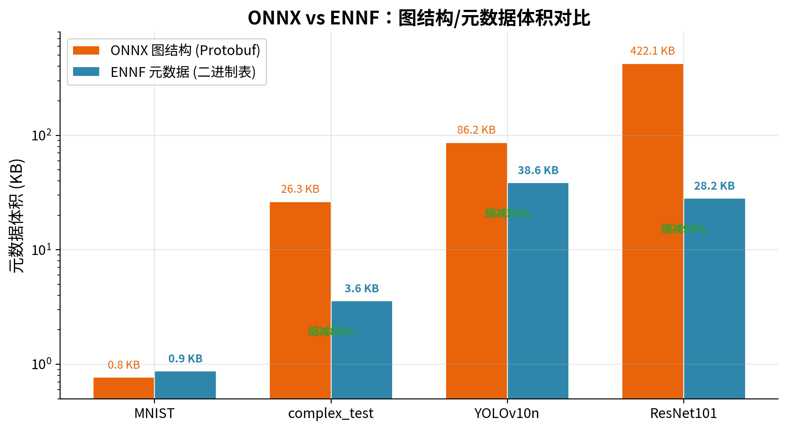
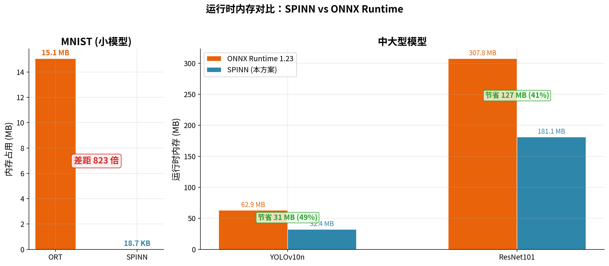
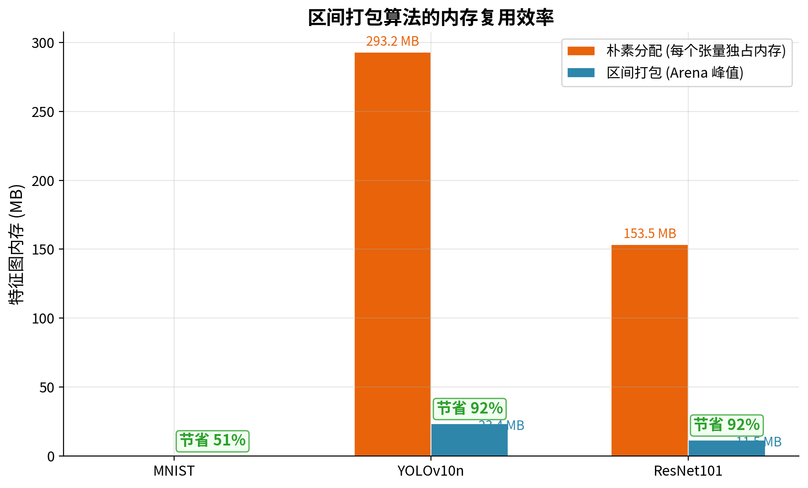
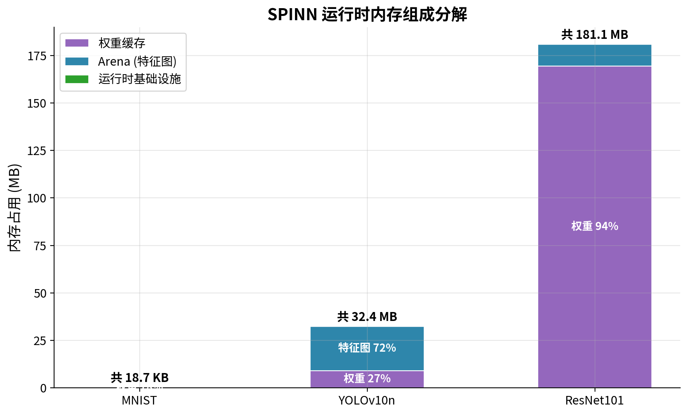

# 周会汇报
## 一、模型格式

ONNX，底层用 Google Protobuf 做序列化。ONNX 的目标是做跨框架的交换格式——PyTorch、TensorFlow 训练完都能导出成 .onnx，拿到另一个框架里跑。为了通用和调试方便，节点之间的连接关系全部用字符串名称引用。ResNet101，Conv

```protobuf
NodeProto {
  op_type: "Conv"                          ← 字符串
  name:    "node_Conv_1468"                ← 字符串，调试
  input:   ["x", "conv1.weight"]           ← 字符串，引用输入张量
  output:  ["getitem"]                     ← 字符串，引用输出张量
  attribute { name: "kernel_shape"  ints: [3, 3] }
  attribute { name: "pads"  ints: [3, 3, 3, 3] }
  attribute { name: "strides"  ints: [2, 2] }
}
```
解析这种格式需要 Protobuf 解码库，首先空间占用源码314.5 KB（解码器 127.5 KB + ONNX 协议定义 187.0 KB）。
其次，字符串在推理时不用——ResNet101 的 .onnx 文件分为图结构（432 KB）和权重数据（170 MB）两个文件，在432 KB 的图结构里，92.8%（401 KB）是字符串。每次要查某个节点的输入张量，字符串去做 strcmp 匹配。

ENNF格式，把所有字符串引用换成整数ID。Conv节点

```c
ENNF_NodeBase {           // 8 字节固定头
  op_type:    0x01        // Conv 的整数枚举，2字节
  num_inputs: 2
  num_outputs: 1
  params_size: 28         // 后面参数段的长度
}
// 变长数据:
input_ids:  [0, 5]       // 整数 ID，每个 2 字节，当数组下标
output_ids: [11]
params: {kernel=[3,3], pads=[3,3,3,3], strides=[2,2]}  // 紧凑二进制
```

文件中二进制布局和C结构体对应，`fread` 顺序读就行，不需要任何解码。先读 8 字节固定头知道有几个输入输出、参数多长，再按数量读变长部分。查找输入张量就是 `tensors[input_ids[0]]`，整数下标直接访问数组。

对比（只看去掉权重）：



| 模型 | ONNX 图结构 | ENNF 元数据 | 缩减 |
|:---|---:|---:|---:|
| MNIST (5节点) | 0.8 KB | 0.9 KB | — |
| YOLOv10n (308节点) | 86.2 KB | 38.6 KB | **55%** |
| ResNet101 (241节点) | 422.1 KB | 28.2 KB | **93%** |

模型越大，字符串占比越高，ENNF的优势越明显。解析代码体积也从 314.5 KB 降到 23.1 KB。

---

## 二、运行时内存

ONNX 推理引擎是 ONNX Runtime（ORT）。加载一个 MNIST 模型为（5 个节点、15 KB 权重）。

```
阶段 1. 加载 ORT 共享库           → 基线39MB
阶段 2. 创建 InferenceSession     → +8 MB
阶段 3. 执行一次推理              → +7 MB
────────────────────
总增量: ~15 MB
```
ORT内存开销：

**阶段 1** 加载 `libonnxruntime.so` 共享库。这个库包含了所有算子（Conv、MatMul、Softmax 等几百个）的 C++ 编译后机器码、Protobuf 解析器、图优化引擎、多后端适配层（CPU/CUDA/TensorRT 等）。

**阶段 2** 创建推理会话。Protobuf 反序列化，把 .onnx 文件解码成 C++ 对象——每个节点的 op_type、name、input、output 都是 `std::string`，一个 `std::string`。二是图优化 Pass（常量折叠、Layout 变换、算子融合等），每个Pass遍历全图、增删节点，中间产生大量临时对象。三是初始化 BFC（Best-Fit with Coalescing）内存池——ORT要支持动态 shape 和多线程并发，不能提前确定每个张量的位置，必须用通用运行时分配器。四是为每个节点从注册表里查到对应的 Kernel 类（比如 `Conv` → `ConvKernel`），实例化C++对象。

**阶段 3** 执行推理，BFC 内存池扩张分配特征图空间。
支持动态输入尺寸、要支持 CUDA/TensorRT 等多后端、要支持多线程并发。固定空间占用，而且模型大小基本无关。

SPINN每个组件只分配实际需要的字节数。MNIST模型：

```
SpinnContext 结构体:    216 bytes     ← 整个推理引擎的上下文，存模型元信息和各池子的指针
Tensor 池 (11个):       792 bytes     ← 每个张量的描述信息（维度、大小、数据指针），不是数据本身
Node 池 (4个):          192 bytes     ← 每个节点的描述信息（算子类型、输入输出ID）
Node params:            100 bytes     ← 节点的参数（如Conv的kernel_shape、strides等）
weight_cache 表:         88 bytes     ← 记录每个权重在文件中的偏移量，用于按需加载
Arena (特征图):        2784 bytes     ← 所有中间特征图共享的一整块内存，区间打包后的峰值
权重缓存:            15016 bytes     ← 从文件读进来的实际权重数据（卷积核、bias等浮点数）
─────────────────
总计: 18.7 KB
```

特征图，ORT做运行时动态分配和回收，SPINN区间打包（Interval Packing）——在planning阶段获得每个特征图的生命周期（哪个节点产生、哪个节点最后使用，固定大小的 Arena 里提前配置位置，让生命周期不重叠的张量共享同一段内存。推理时直接用预先算好的offset，不做任何 malloc。

```
时间轴 (节点执行顺序) →
张量A: [===]              ← 节点0产生, 节点2用完
张量B:    [========]      ← 节点1产生, 节点5用完
张量C: [===]              ← 节点0产生, 节点2用完
                           A和C重叠不能共享, 但A结束后它的位置可以给后面的张量复用
```

三个模型上的总内存对比：



| 模型 | ONNX Runtime | SPINN | 差距 |
|:---|---:|---:|:---|
| **MNIST** | **15.07 MB** | **18.7 KB** | ORT 是 SPINN 的 **823 倍** |
| **YOLOv10n** | 62.93 MB | 32.36 MB | SPINN 少 **30.6 MB (49%)** |
| **ResNet101** | 307.75 MB | 181.07 MB | SPINN 少 **126.7 MB (41%)** |

模型差距"只有"一倍左右，权重两边都要加载（ResNet101 权重 170 MB），区别部分的是中间特征图和框架本身。



| 模型 | 所有特征图独占时 | 区间打包后 | 节省 |
|:---|---:|---:|---:|
| YOLOv10n (325个特征图) | **293 MB** | **23 MB** | **92%** |
| ResNet101 (242个特征图) | **154 MB** | **11 MB** | **92.5%** |

SPINN 内存组成：



| 模型 | 运行时基础设施 | Arena (特征图) | 权重缓存 | 总计 |
|:---|---:|---:|---:|---:|
| MNIST | 1.4 KB (7%) | 2.7 KB (15%) | 14.7 KB (78%) | **18.7 KB** |
| YOLOv10n | 58.9 KB (<1%) | 23.4 MB (72%) | 8.9 MB (27%) | **32.4 MB** |
| ResNet101 | 43.4 KB (<1%) | 11.5 MB (6%) | 169.5 MB (94%) | **181.1 MB** |

运行时基础设施始终不到 60 KB。ResNet101 里 94% 是权重本身，不可压缩。

---

